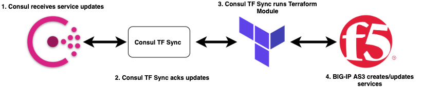

# BIG-IP Application Consul-Terraform-Sync Module

This terraform module leverages consul-terraform-sync to create and update application services on BIG-IP based on registered services within Consul. Please open github issues with feature requests or bugs for further advancement.

terraform-bigip-app-consul-sync



## Requirements

| Name | Version |
|------|---------|
| terraform | >= 0.13 |
| consul-terraform-sync | >= 0.1.0 |
| consul | >= 1.7 |

## Providers

| Name | Version |
|------|---------|
| bigip | ~> 1.3.2 |

## Setup / Notes
* Service definitions in consul must include meta-data for the BIG-IP VirtualServer IP (VSIP), Port (VSPORT), and AS3 Template name (AS3TMPL)...(see examples).
* AS3 templates must be placed within the `as3templates` directory of the module. The module ships with an HTTP and TCP template for getting started.
* Consul services that you wish to auto-update must be listed within the *consul-terraform-sync* configuration.
* All consul services will be placed within the same AS3 Tenant on BIG-IP named **consul-terraform-sync**
* The Application and Pool on BIG-IP will be named from the Consul Service


## Examples
The 3  example service nodes in Consul below will create 2 AS3 applications on BIG-IP with pool members as the node_addresses from consul.


### Consul Services (Input)
The API payloads for consul services registration below are used as examples. The same input would normally be provided through the HCL configuration when a service node registers itself.

  ```
    {
        "Node": "node1",
        "Address": "10.27.39.27",
        "Service": {
            "ID": "node1",
            "Service": "f5s1",
            "Address": "10.27.39.27",
            "Meta": {
                "VSIP": "10.39.27.5",
                "VSPORT": "8080",
                "AS3TMPL": "http"
            },
            "Port": 8000
        }
    },
    {
        "Node": "node2",
        "Address": "10.27.39.28",
        "Service": {
            "ID": "node2",
            "Service": "f5s1",
            "Address": "10.27.39.28",
            "Meta": {
                "VSIP": "10.39.27.5",
                "VSPORT": "8080",
                "AS3TMPL": "http"
            },
            "Port": 8000
        }
    },
    {
        "Node": "node3",
        "Address": "10.27.39.29",
        "Service": {
            "ID": "node3",
            "Service": "f5s2",
            "Address": "10.27.39.29",
            "Meta": {
                "VSIP": "10.39.27.6",
                "VSPORT": "22",
                "AS3TMPL": "tcp"
            },
            "Port": 22
        }
    }
  ```

  The data is then transformed via **Consul-Terraform-Sync** and provided to the Terraform module as an input variable.

### BIG-IP Applications (AS3 Output)

The Terraform module transforms the Consul services into BIG-IP applications using the templates defined (TCP/HTTP by default).


| App | VirtualServer | Members | 
|------|-------------|------|
| f5s1 (http app) | 10.39.27.5:8080 | 10.27.39.27 10.27.39.28  |
| f5s2 (tcp app) | 10.39.27.6:80 | 10.27.39.29 |


### Config for consul-terraform-sync

``` terraform
driver "terraform" {
  log = true
  required_providers {
    bigip = {
      source = "F5Networks/bigip"
    }
  }
}
consul {
  address = "10.1.2.3.4:8500"
}

provider "bigip" {
  address  = "10.1.2.5:8443"
  username = "admin"
  password = "pass"
}

task {
  name = "AS3"
  description = "AS3 APPS"
  source = "f5devcentral/bigip/app-consul-sync"
  providers = ["bigip"]
  services = ["f5s1","f5s2"]
  variable_files = ["/Users/test/test.tfvars"] # Specify tenant_name variable here to override the AS3 Tenant on BIG-IP
}
```

